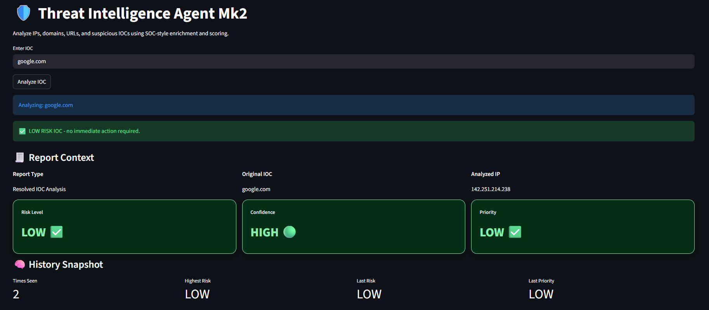
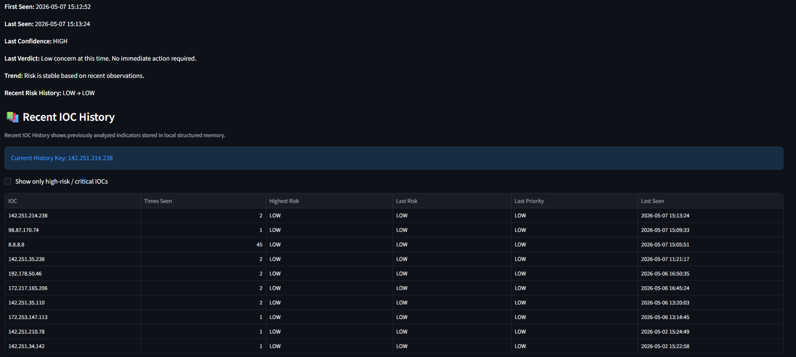
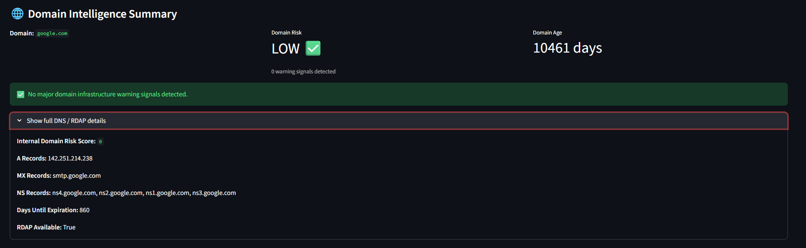
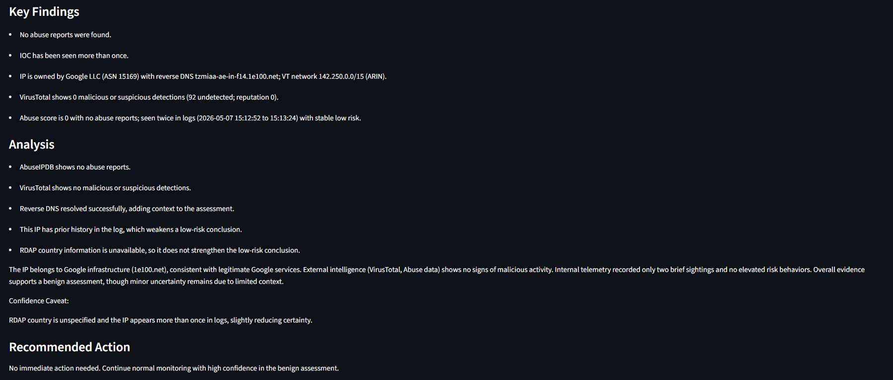
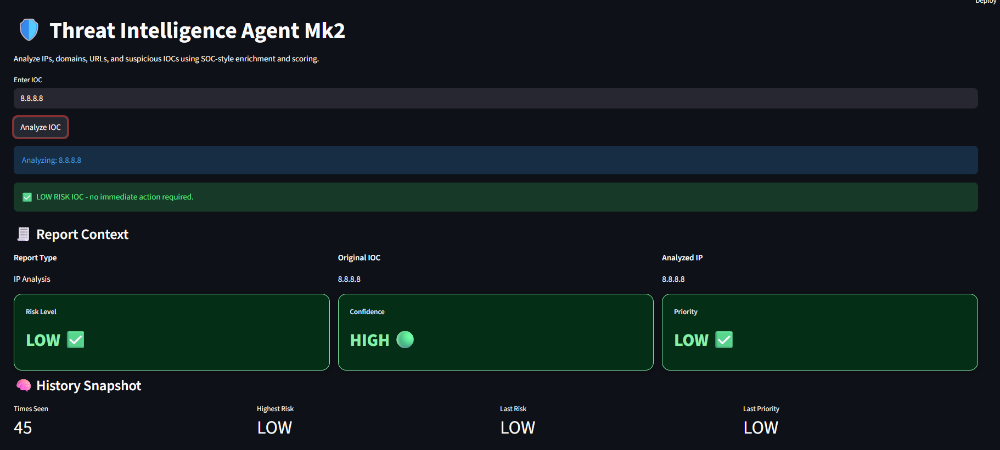
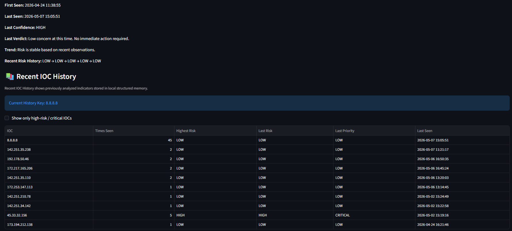
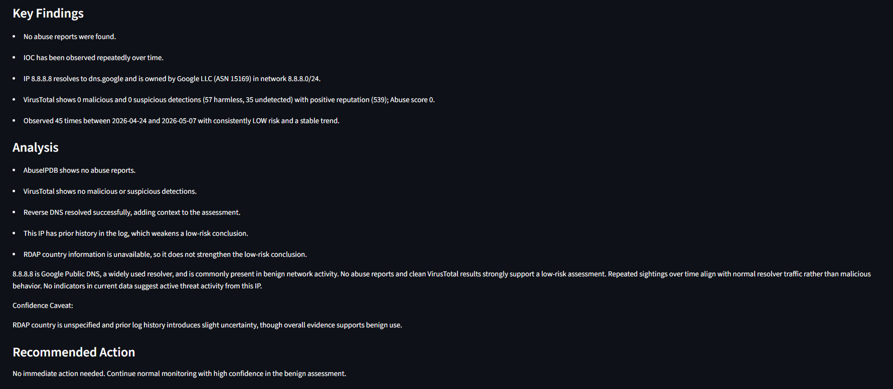
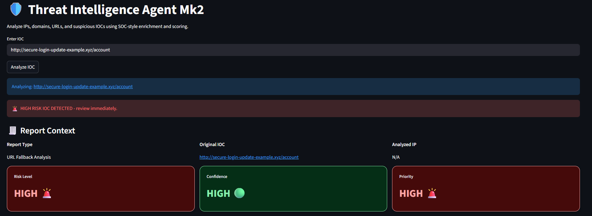
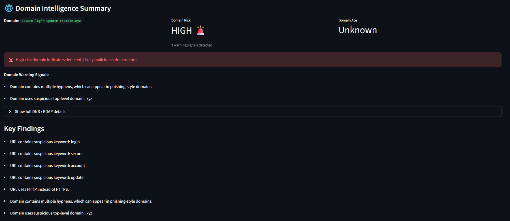

# 🛡️ Threat Intelligence Agent

A SOC-style threat intelligence platform for analyzing IPs, domains, and URLs using enrichment, scoring, and AI-powered analysis.

---

## 🚀 Project Evolution

### 🔹 Mk1
- IP-based threat intelligence
- AbuseIPDB + VirusTotal enrichment
- CLI-based analysis
- Basic risk scoring

### 🔹 Mk2 (Current)
📁 Located in `/TIAMk2`

- Full SOC-style Streamlit dashboard
- Domain intelligence (DNS + RDAP)
- URL heuristic analysis (phishing detection)
- Structured IOC memory tracking
- Risk + Confidence + Priority scoring
- AI-generated analyst reports

## 📸 Mk2 Dashboard Preview

### 🟢 Low-Risk Domain Analysis





---

### 🟢 Low-Risk IP Analysis




---

### 🔴 High-Risk URL Analysis



---

## 🎯 Purpose

This project simulates real-world Security Operations Center (SOC) workflows, including:

- Threat enrichment
- Detection logic
- Risk scoring
- Analyst reasoning
- Incident triage

---

## ⚡ How to Run Mk2

```bash
cd TIAMk2
pip install -r requirements.txt
streamlit run dashboard.py
